# CLEX 2017 ECR Workshop: Materials

Need another copy of these materials? Go to https://github.com/clex-2017-ecr-workshop.

## 1. Before you arrive

Before you arrive at the workshop, you should do two things:

**Sign up for Github:** go to [github.com](https://github.com) and sign up for an account.

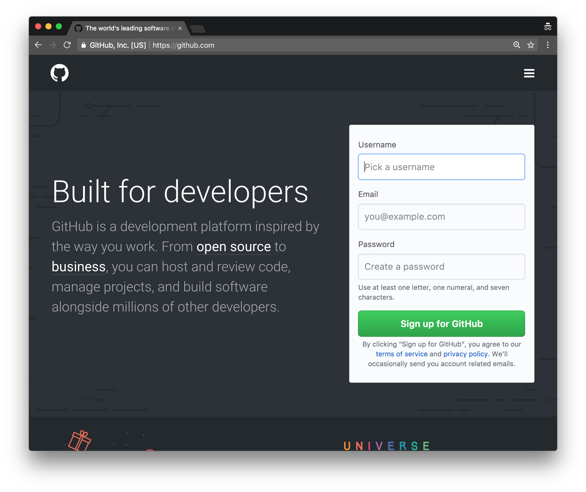

You'll probably get an account validation email, so open that up and click on the link to get your account going. Once you're logged in, feel free to have a look around!

**Download the Github Desktop client:** go to [desktop.github.com](https://desktop.github.com) and download the app. 

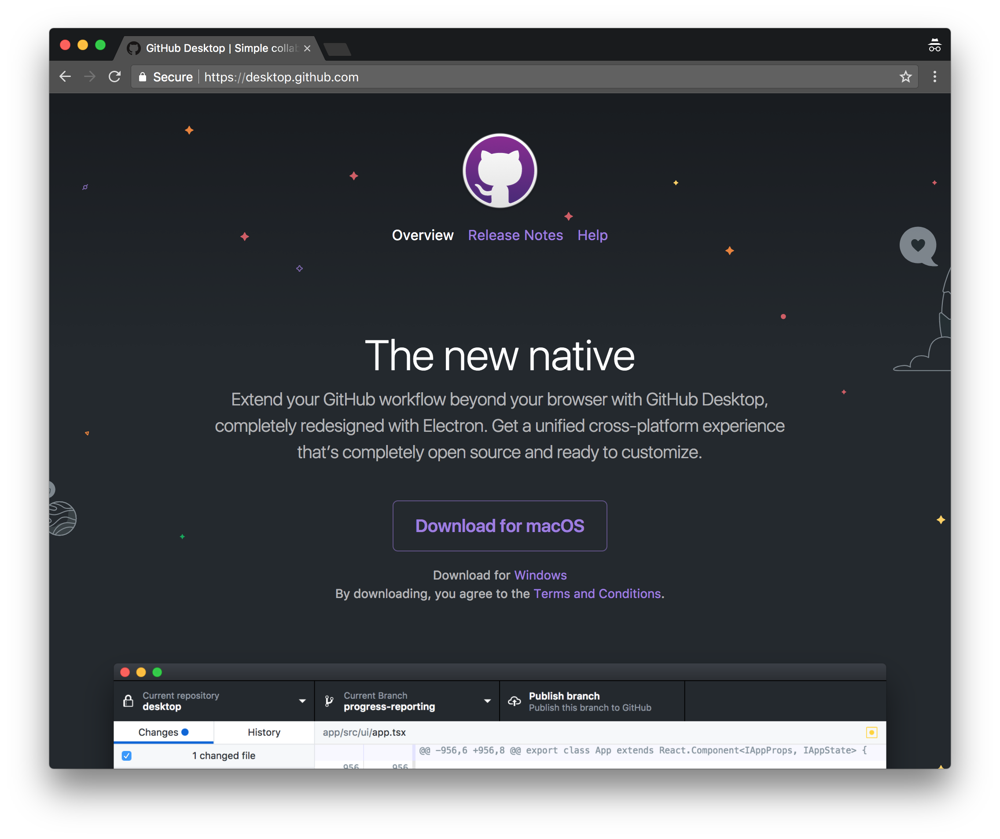

## 2. What's git, and why do I care? [10 min intro]

**TKTKTK presentation goes here!**

## 3. Choose a theme to start with

There are lots of ways to start a repo, but today we're going to **_fork_** someone else's repo—an empty website theme that we can build on. Feel free to browse [jekyllthemes.org](http://jekyllthemes.org) or [jekyllthemes.io](https://jekyllthemes.io) for a theme that looks nice.

Here're a few that look good (in my opinion) and will work today (don't sweat it if you change your mind later!):

- http://jekyllthemes.org/themes/flexible-jekyll/
- https://jekyllthemes.io/theme/38934900/Jekyll_modern-blog
- http://jekyllthemes.org/themes/jekflix/
- https://jekyllthemes.io/theme/23162068/agency-jekyll-theme
- https://jekyllthemes.io/theme/8068127/hyde
- https://jekyllthemes.io/theme/10558278/solar-theme-jekyll
- https://jekyllthemes.io/theme/10267810/minimal-mistakes

Once you've found a theme, we want to fork it. Find the GitHub repo: on jekyllthemes.org, that's the `Homepage` button; on jekyllthemes.io, it's the picture of the theme. The address will be `https://github.com/[author]/[name]`.

On the repo page, you want to click on the grey 'Fork' button.

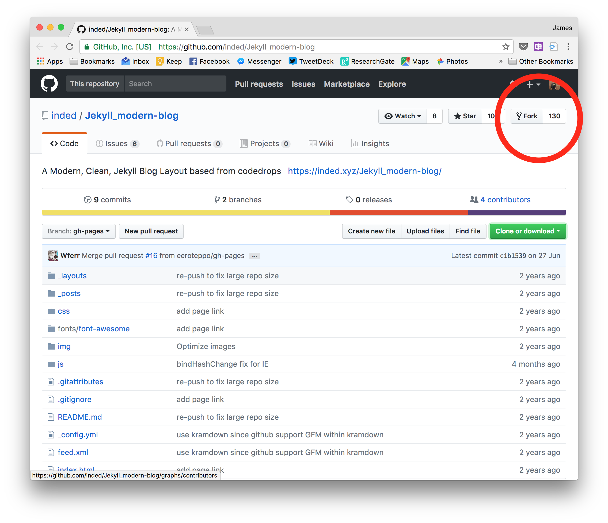

Forking will take a few seconds, but then you'll have your own version! (It'll say where it's come from up the top.) The page you get dropped at, https://github.com/username/project, is the _repo page_.

We need to change a few settings to get this going as a website, too. Click on the settings button:

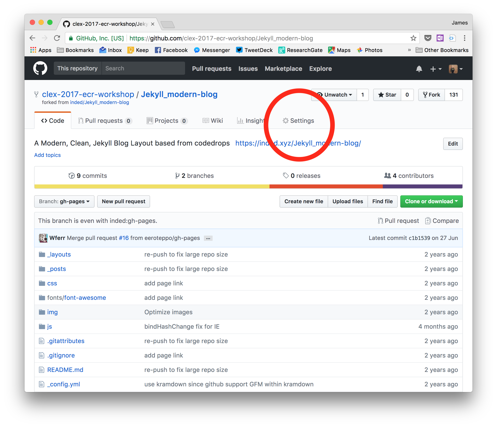

First, we need to name this repo something specific. That's because GitHub allows you to have websites for your repos, but it also allows you to have a special one for yourself. We're doing a website for _you_ today, so name the repo `username.github.io`, where `username` is... yeah.

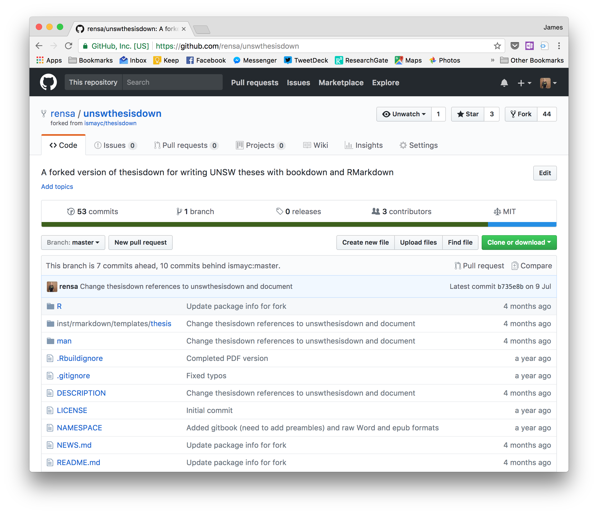

Then scroll down to the GitHub Pages section and make sure the Source menu either says `master` branch. (`None` can be used if you want to disable your website for a while.)

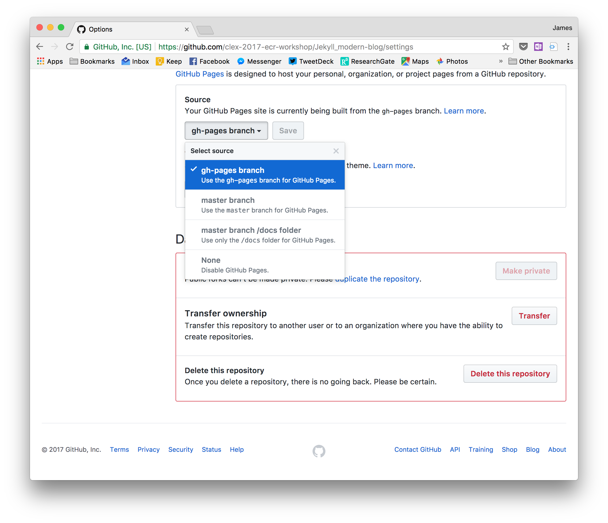

**(Not working?)** Some older themes used different settings. If you can only see `gh-pages` here, go back from the settings to your repo's main page, click the branch button, type `master` in the box and choose to `create branch: master from gh-pages`. Like this:

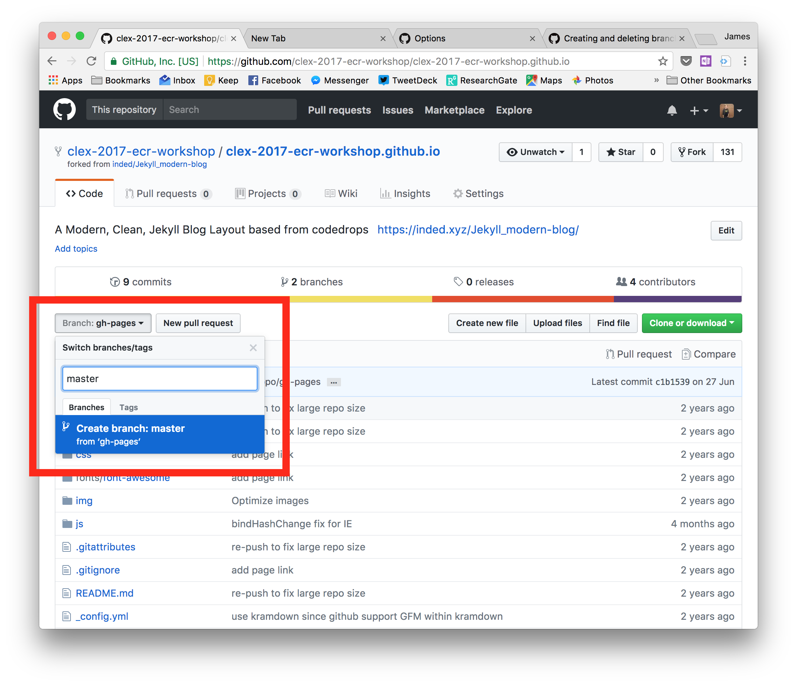

**That's it!** You can now visit your site at https://username.github.io. Of course, it would be nice to put some stuff in it. Let's start editing.

### Aside: other ways to create repos

Forking an existing repo isn't the only way to get started. We won't cover it today, but you can also:

- _initialise_ a repo on Github and then _clone_ it (create a copy on your computer that is linked to GitHub), or
- _initialise_ a repo on your computer using git (even one with existing work in it), and then point it to a repo on GitHub.

## 4. Cloning your website

Although you can create and edit files directly on github.com, today we're going to use the Github Desktop app to _clone_ our repo. That means we'll download a copy of it, and that copy will know where to send any changes we make.

Normally, if you want to clone your repo, you'd need to click the bright green 'Clone or download' button on your repo page. People usually call this the clone address:

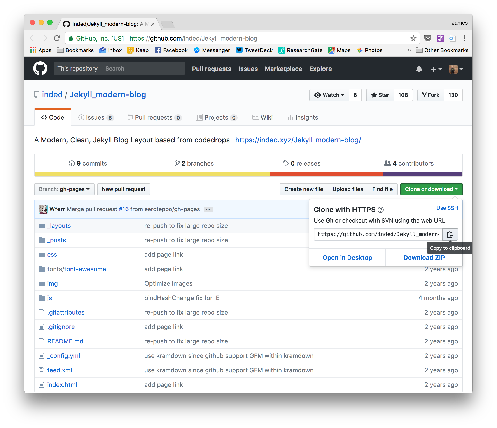

But the Github Desktop app can handle this for us. Once you're signed in, go to `File > Clone repository...`. It'll show you all of your GitHub repos:

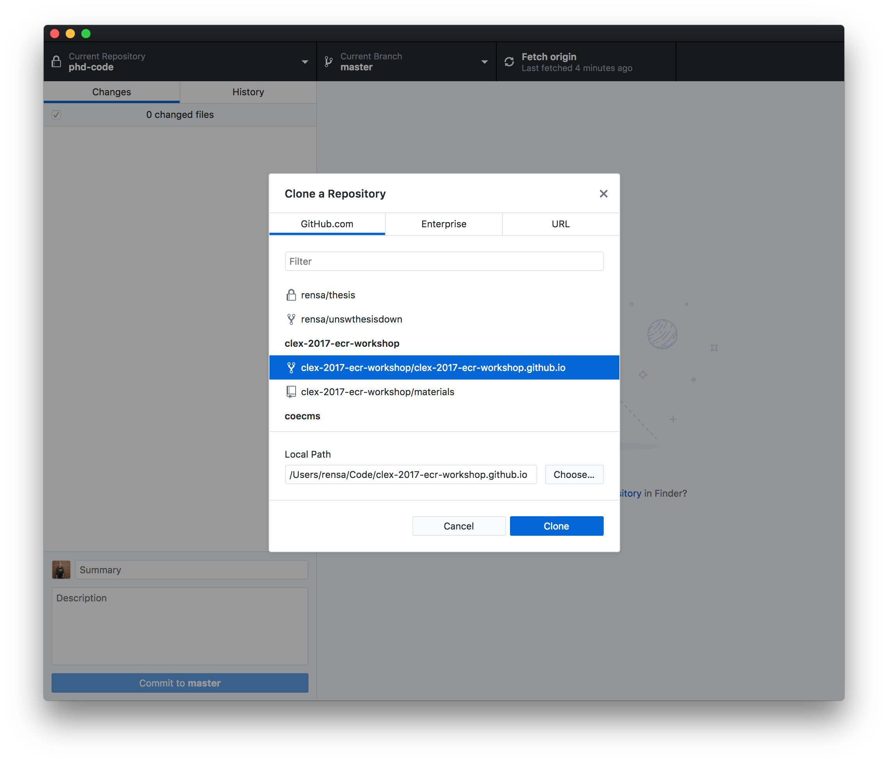

Select your website repo. If you have a specific place on your computer where you like to keep stuff, you can select that folder here. Then hit `Clone`.

The timelines of git projects are measured in _commits_: changes to groups of files. A commit might just be a few paragraphs added to one file, or it might be changes to a dozen files, plus soe new files, plus the removal of some more files.

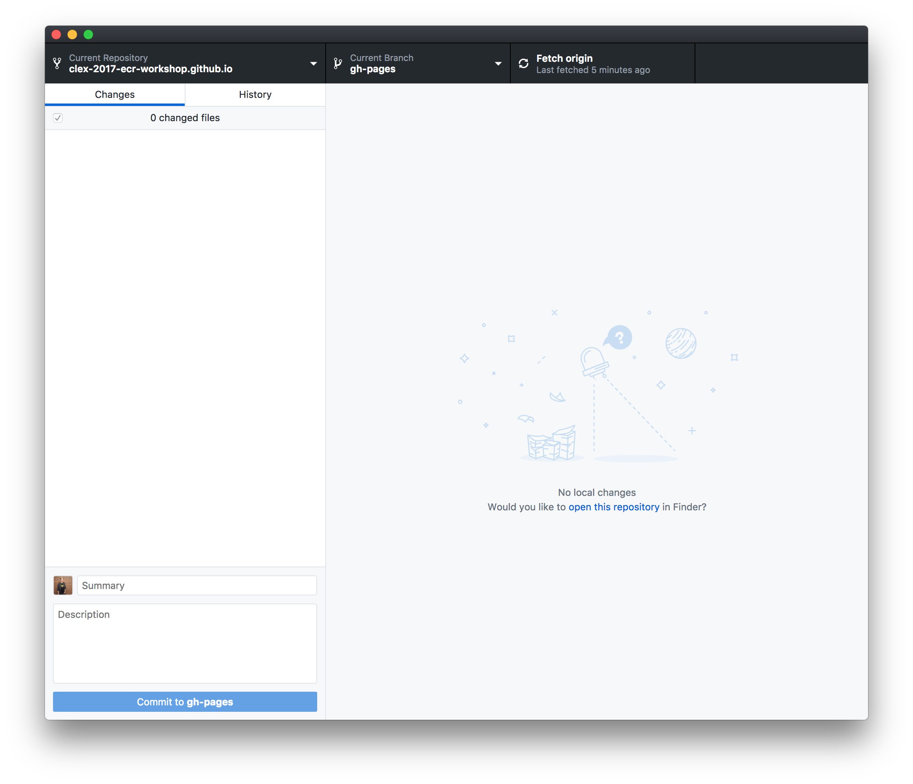

This app has two views: your `Changes`, where you can see everything you've done since your last commit, and `History`, where you can see all of the previous commits. Since we haven't changed any files since we cloned, things are pretty quiet. But let's `open the repository` and have a look at the structure of a Jekyll website:

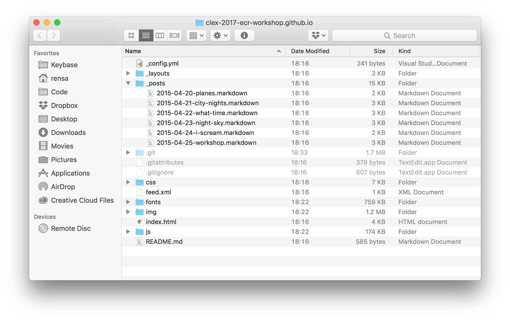

There'll be various extras depending on your theme, but the most typical parts of a Jekyll theme are:

- `_config.yml`, which is the settings file. It's plain text.
- `_posts`, which is where your blog posts go. You can write them in HTML (like web pages), in plain text or in [Markdown](https://guides.github.com/features/mastering-markdown/), which is a way to write spice up plain text with some basic formatting.
- `_layouts` and `_includes`, which is where Jekyll themes keep their web layouts and reusable bits of content. You oughtn't need to touch these folders unless you want to get under the hood.

There're also a couple of things that git uses. (They're all files that start with a full stop; if you can't see them, it's because they're hidden.) The `.git` folder, in particular, is where git does all of its magic. **Don't touch it.**

The `_posts` folder is where we get to add our posts. Most themes should come with a few sample posts already.

## X. What's next?

Need a refresher on the theory? Read this paper: 

_Bryan, J. “Excuse Me, Do You Have a Moment to Talk about Version Control?” PeerJ Preprints, August 28, 2017. [doi: 10.7287/peerj.preprints.3159v2](https://doi.org/10.7287/peerj.preprints.3159v2)._
