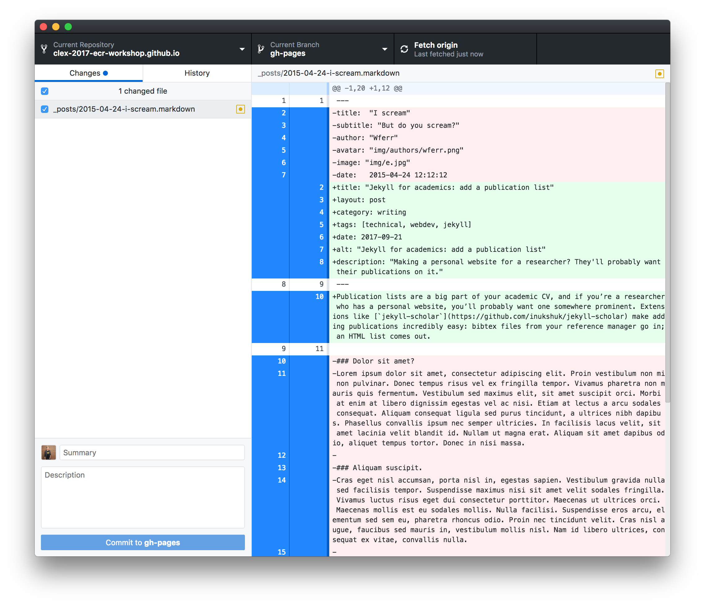
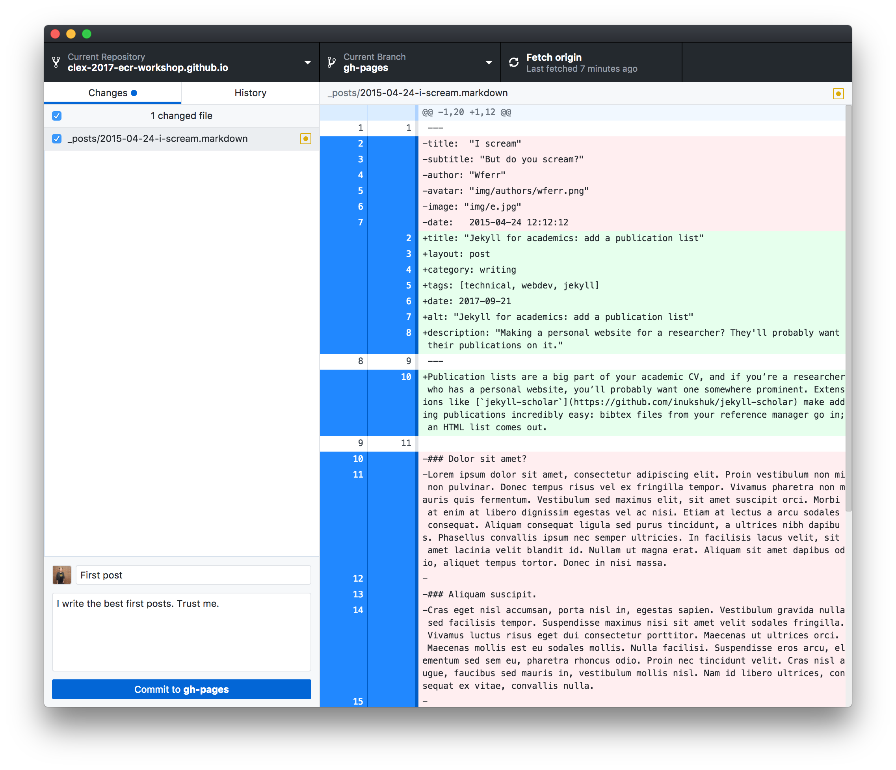
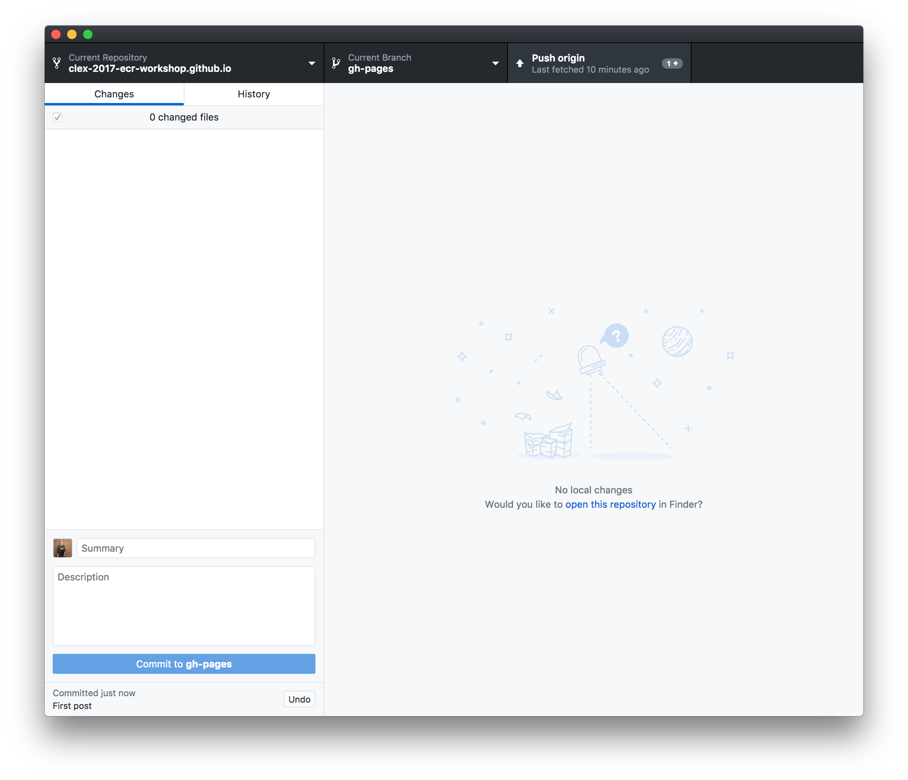

# CLEX 2017 ECR Workshop: Materials

Need another copy of these materials? Go to https://github.com/clex-2017-ecr-workshop.

## 1. Before you arrive

Before you arrive at the workshop, you should do two things:

**Sign up for Github:** go to [github.com](https://github.com) and sign up for an account.


You'll probably get an account validation email, so open that up and click on the link to get your account going. Once you're logged in, feel free to have a look around!

**Download the Github Desktop client:** go to [desktop.github.com](https://desktop.github.com) and download the app. 


## 2. What's git, and why do I care? [10 min intro]

**TKTKTK presentation goes here!**

## 3. Choose a theme to start with

There are lots of ways to start a repo, but today we're going to **_fork_** someone else's repo—an empty website theme that we can build on. Feel free to browse [jekyllthemes.org](http://jekyllthemes.org) or [jekyllthemes.io](https://jekyllthemes.io) for a theme that looks nice.

Here're a few that look good (in my opinion) and will work today (don't sweat it if you change your mind later!):

- http://jekyllthemes.org/themes/flexible-jekyll/
- https://jekyllthemes.io/theme/38934900/Jekyll_modern-blog
- http://jekyllthemes.org/themes/jekflix/
- https://jekyllthemes.io/theme/23162068/agency-jekyll-theme
- https://jekyllthemes.io/theme/8068127/hyde
- https://jekyllthemes.io/theme/10558278/solar-theme-jekyll
- https://jekyllthemes.io/theme/10267810/minimal-mistakes

Once you've found a theme, we want to fork it. Find the GitHub repo: on jekyllthemes.org, that's the `Homepage` button; on jekyllthemes.io, it's the picture of the theme. The address will be `https://github.com/[author]/[name]`.

On the repo page, you want to click on the grey 'Fork' button.


Forking will take a few seconds, but then you'll have your own version! (It'll say where it's come from up the top.) The page you get dropped at, https://github.com/username/project, is the _repo page_.

We need to change a few settings to get this going as a website, too. Click on the settings button:


First, we need to name this repo something specific. That's because GitHub allows you to have websites for your repos, but it also allows you to have a special one for yourself. We're doing a website for _you_ today, so name the repo `username.github.io`, where `username` is... yeah.


Then scroll down to the GitHub Pages section and make sure the Source menu either says `master` branch. (`None` can be used if you want to disable your website for a while.)


**(Not working?)** Some older themes used different settings. If you can only see `gh-pages` here, go back from the settings to your repo's main page, click the branch button, type `master` in the box and choose to `create branch: master from gh-pages`. Like this:


**That's it!** You can now visit your site at https://username.github.io. Of course, it would be nice to put some stuff in it. Let's start editing.

### Aside: other ways to create repos

Forking an existing repo isn't the only way to get started. We won't cover it today, but you can also:

- _initialise_ a repo on Github and then _clone_ it (create a copy on your computer that is linked to GitHub), or
- _initialise_ a repo on your computer using git (even one with existing work in it), and then point it to a repo on GitHub.

## 4. Cloning your website

Although you can create and edit files directly on github.com, today we're going to use the Github Desktop app to _clone_ our repo. That means we'll download a copy of it, and that copy will know where to send any changes we make.

Normally, if you want to clone your repo, you'd need to click the bright green 'Clone or download' button on your repo page. People usually call this the clone address:


But the Github Desktop app can handle this for us. Once you're signed in, go to `File > Clone repository...`. It'll show you all of your GitHub repos:


Select your website repo. If you have a specific place on your computer where you like to keep stuff, you can select that folder here. Then hit `Clone`.

The timelines of git projects are measured in _commits_: changes to groups of files. A commit might just be a few paragraphs added to one file, or it might be changes to a dozen files, plus soe new files, plus the removal of some more files.


This app has two views: your `Changes`, where you can see everything you've done since your last commit, and `History`, where you can see all of the previous commits. Since we haven't changed any files since we cloned, things are pretty quiet. But let's `open the repository` and have a look at the structure of a Jekyll website:


## 5. Writing and editing posts

There'll be various extras depending on your theme, but the most typical parts of a Jekyll theme are:

- `_config.yml`, which is the settings file. It's plain text.
- `_posts`, which is where your blog posts go. You can write them in HTML (like web pages), in plain text or in [Markdown](https://guides.github.com/features/mastering-markdown/), which is a way to write spice up plain text with some basic formatting.
- `_layouts` and `_includes`, which is where Jekyll themes keep their web layouts and reusable bits of content. You oughtn't need to touch these folders unless you want to get under the hood.

There're also a couple of things that git uses. (They're all files that start with a full stop; if you can't see them, it's because they're hidden.) The `.git` folder, in particular, is where git does all of its magic. **Don't touch it.**

The `_posts` folder is where we get to add our posts. Most themes should come with a few sample posts already, and they'll almost certainly be in Markdown (with the file extension `.md` or `.markdown`. Open one up in a basic text editor—Notepad (Windows), TextEdit (Mac) or your code editor is totally fine. (Microsoft Word isn't, though!).

Markdown files are just plain text. They start with some _front matter_: a bunch of options surrounded by `---`. The post content follows:


The basic rules of Markdown are that you can `**bold text**`, `_italicise it_`,

```
* make a few
* bullet points
* using asterisks

1. or even
2. some numbers

# and start lines with hashtags to create headings!
```

Markdown can do other stuff, though, like images, links and tables, so [have a look at this cheat sheet]((https://guides.github.com/features/mastering-markdown/)) if you need some help.

Try turning a couple of the sample posts into real ones (no pressure if you don't have anything up your sleeve) or creating new ones. Save as you go, just as you would a regular file.

## 6. Add, commit and push

Okay, so this is where the version control comes back in. Let's flick back to the Gthub Desktop app. It's looking busier now:



In the left column, we have the files that have changed (assuming we've saved those changes). On the right, we can see exactly which lines in the selected file have changed: additions in green, removed lines in red.

In git, you don't have to  commit everything you've changed at once. You might want to commit some of your changed files separately—that way, when you look back at your project, you can see what was happening more clearly. In order to do this, you _add_ files that you want to commit (files that have been added are sometimes called _staged files_, and they're referred to as being in the _index_. git has like ten different names for everything).

In the Desktop app, we do the adding and commiting in one step: we check the files that we want to add, write a summary that describes the changes in one line (and a longer description if we want more notes for later), and then we hit `Commit to master`:



It's saved now—not just on your disk, but in version control. With some more git skills, you could return the file back to this state no matter what you later did to it.

But it isn't live yet. If we want the version of our website repo to reflect these changes, we need to `Push` our commits.

There's a handy button for that, up the top-right:



Once you've done that, you can go back to your repo page an see the changes there—or you can go to your website and see the post live! Nice job!

## 7. Optional activities

There're a bunch of different ways we can explore from here in the second half of the session:

1. Start a new repo from scratch, using the `New repository` button in Github (look for the + button up the top-right). Make sure you elect to "Initialize this repository with a README", which will make getting started easier.
2. Look through `_config.yml` and see whether your blog theme comes with any interesting customisation options built-in.
3. Delete the site and start over! Back up the `_posts` folder (copy it somewhere else), delete the local repo and the version on GitHub (it's in the Settings), then fork and clone a new theme and copy the `_posts` folder back in.
4. Try creating static pages for your blog/site. Take a look at `index.html`: in most themes, static pages are just written the same way as posts, with some minimal front matter followed by some content (more often done in HTML, but you can use Markdown too!). Try copying `index.html` with another name (`greatpage.html`) and see if you can figure out how to modify it.
5. Hook a domain up to your site, if you have one. This is on the harder side.
6. If you have some command line experience, try [installing Jekyll on your laptop](https://jekyllrb.com/) so that you can test your website before you push your changes.

## X. What's next?

Make sure you [sign up for the Github Student Developer Pack](https://education.github.com/pack). It takes a few weeks to go through, but it comes with free private repos (in case you're not ready to share your work with people) for two years (renewable as long as you're a student), plus a bunch of credit for other computer services.

This was a very small taste of git! If you liked what you saw and would like to consider using it more, you might want to consider getting a proper introduction to it. Most guides teach you how to use a command line to do this, but if you're not quite ready to try the one on your laptop, you could practise with [this mock command line built by GitHub](https://try.github.io/). Can't break anything there!

Software Carpentry offers a [very thorough course on version control with git](http://swcarpentry.github.io/git-novice/), and it comes highly recommended, covering several concepts that we skipped over today. However, it assumes some familiarity with the comand line. If you're also new to that, you might want to start with their [shell tutorial](http://swcarpentry.github.io/shell-novice/). These lessons often all get packed into one day when SC do their workshops at centre nodes, so it can sometimes be overwhelming to do it all at once.

If you're fine with git but want to explore Jekyll and Github Pages further, start by [installing Jekyll and looking at the documentation](https://jekyllrb.com). Jekyll sites are _pre-generated_—that is, you run the program to process your posts and other files into static HTML (Github Pages cheats and does that for you), so you can always set your site up somewhere else if you don't like or are obliged not to use GitHub Pages.

Need a refresher on the theory? A lot of the theory at the start of today's session came from this excellent paper: 

_Bryan, J. “Excuse Me, Do You Have a Moment to Talk about Version Control?” PeerJ Preprints, August 28, 2017. [doi: 10.7287/peerj.preprints.3159v2](https://doi.org/10.7287/peerj.preprints.3159v2)._

Good luck!
